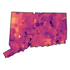
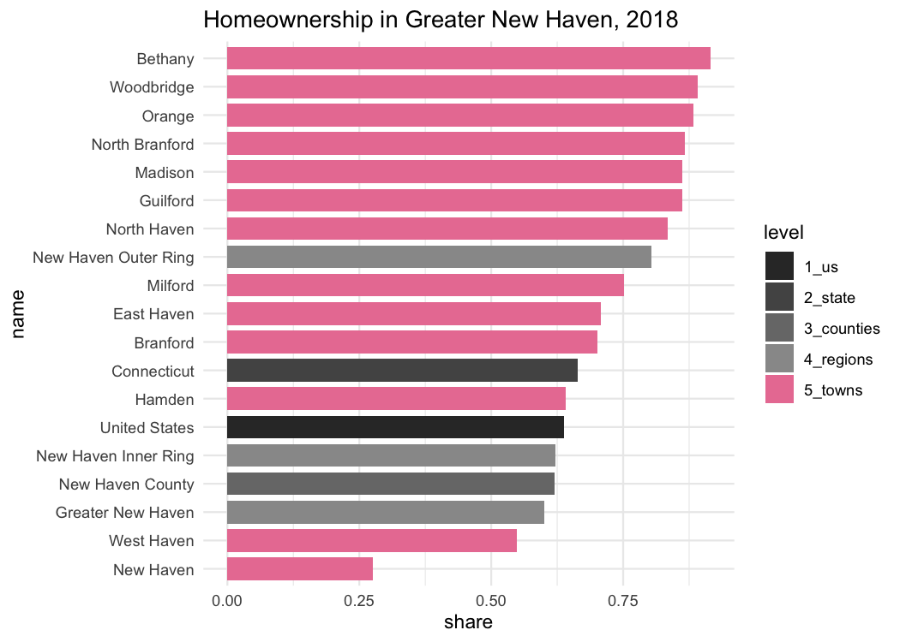

<!-- README.md is generated from README.Rmd. Please edit that file -->
cwi 
====================================================

[](https://travis-ci.org/CT-Data-Haven/cwi)

The goal of `cwi` is to get data, primarily the Census ACS, fetched, aggregated, and analyzed for [DataHaven's 2019 Community Index reports](http://ctdatahaven.org/reports/greater-new-haven-community-index). This includes functions to speed up and standardize analysis for multiple staff people, preview trends and patterns we'll need to write about, and get data in more layperson-friendly formats.

It depends on many functions from Camille's brilliantly-named [`camiller`](https://github.com/camille-s/camiller) package.

Installation
------------

You can install this package from [GitHub](https://github.com/CT-Data-Haven/cwi) with:

``` r
# install.packages("devtools")
devtools::install_github("CT-Data-Haven/cwi")
```

Dependencies
------------

In addition to `camiller`, this package relies heavily on:

-   The [`tidyverse`](http://tidyverse.org/) packages, namely `magrittr`, `dplyr`, `tidyr`, `purrr`, `readr`, `stringr`, `forcats`, and `ggplot2` (version &gt;= 3.0.0) (so basically *all* the tidyverse)
-   `rlang` and `tidyselect` for non-standard evaluation in many functions
-   `tidycensus` for actually getting all the Census data
-   `sf` isn't required but it's encouraged

Data
----

`cwi` ships with several datasets and shapefiles. These include:

-   Shapes (as `sf` objects) of towns, tracts, and city neighborhoods for New Haven, Hartford, Bridgeport, and Stamford
-   Common ACS table numbers—hopefully decreases time spent prowling around [FactFinder](https://factfinder.census.gov)
-   Definitions of neighborhoods by tract or block group, and of regions by town

Sources
-------

This package contains functions to make it easier and more reproducible to fetch and analyze data from:

-   [American Community Survey](https://www.census.gov/programs-surveys/acs/) (US Census Bureau)
-   [Decennial Census](https://www.census.gov/programs-surveys/decennial-census.html) (US Census Bureau)
-   [Quarterly Workforce Indicators](https://lehd.ces.census.gov/) (US Census Bureau Center for Economic Studies)
-   [Local Area Unemployment Statistics](https://www.bls.gov/lau/) (Bureau of Labor Statistics)

More to come (as of 7/17/2018) may include simplifications of working with [LEHD Origin-Destination Employment Statistics](https://lehd.ces.census.gov/data/) (LODES) and ACS public use microdata samples (PUMS) via [IPUMS](https://usa.ipums.org/usa/).

Example
-------

Here's an example of getting a big table to calculate homeownership rates across many geographies at once:

``` r
library(dplyr)
library(stringr)
library(cwi)
```

``` r
tenure <- multi_geo_acs(
  table = basic_table_nums$tenure,
  year = 2016,
  regions = regions[c("Greater New Haven", "New Haven Inner Ring", "New Haven Outer Ring")],
  counties = "New Haven",
  us = T
)
#> Table: TENURE
#> Geographies included:
#> Towns: all
#> Regions: Greater New Haven, New Haven Inner Ring, New Haven Outer Ring
#> Counties: New Haven County
#> State: 09
#> US: Yes
tenure
#> # A tibble: 99 x 8
#>    GEOID NAME            variable   estimate    moe level     state county
#>    <chr> <chr>           <chr>         <dbl>  <dbl> <chr>     <chr> <chr> 
#>  1 1     United States   B25003_001   1.18e8 222078 1_us      <NA>  <NA>  
#>  2 1     United States   B25003_002   7.49e7 360470 1_us      <NA>  <NA>  
#>  3 1     United States   B25003_003   4.28e7 142056 1_us      <NA>  <NA>  
#>  4 09    Connecticut     B25003_001   1.35e6   3509 2_state   <NA>  <NA>  
#>  5 09    Connecticut     B25003_002   9.00e5   5427 2_state   <NA>  <NA>  
#>  6 09    Connecticut     B25003_003   4.54e5   3843 2_state   <NA>  <NA>  
#>  7 09009 New Haven Coun… B25003_001   3.26e5   1531 3_counti… 09    <NA>  
#>  8 09009 New Haven Coun… B25003_002   2.04e5   1887 3_counti… 09    <NA>  
#>  9 09009 New Haven Coun… B25003_003   1.23e5   1716 3_counti… 09    <NA>  
#> 10 <NA>  Greater New Ha… B25003_001   1.77e5   1434 4_regions <NA>  <NA>  
#> # ... with 89 more rows
```

``` r
homeownership <- tenure %>%
  label_acs() %>%
  select(name = NAME, level, label, estimate) %>%
  filter((!str_detect(level, "towns")) | name %in% regions$`Greater New Haven`) %>%
  mutate(label = str_remove(label, "Total!!")) %>%
  group_by(level, name) %>%
  camiller::calc_shares(group = label) %>%
  filter(label == "Owner occupied")

homeownership
#> # A tibble: 19 x 5
#> # Groups:   level, name [19]
#>    level      name                 label          estimate share
#>    <chr>      <chr>                <fct>             <dbl> <dbl>
#>  1 1_us       United States        Owner occupied 74881068 0.636
#>  2 2_state    Connecticut          Owner occupied   900223 0.665
#>  3 3_counties New Haven County     Owner occupied   203568 0.624
#>  4 4_regions  Greater New Haven    Owner occupied   106876 0.602
#>  5 4_regions  New Haven Inner Ring Owner occupied    34337 0.629
#>  6 4_regions  New Haven Outer Ring Owner occupied    58447 0.802
#>  7 5_towns    Bethany              Owner occupied     1807 0.904
#>  8 5_towns    Branford             Owner occupied     8331 0.679
#>  9 5_towns    East Haven           Owner occupied     7919 0.705
#> 10 5_towns    Guilford             Owner occupied     7314 0.855
#> 11 5_towns    Hamden               Owner occupied    15335 0.657
#> 12 5_towns    Madison              Owner occupied     5932 0.874
#> 13 5_towns    Milford              Owner occupied    16314 0.757
#> 14 5_towns    New Haven            Owner occupied    14092 0.282
#> 15 5_towns    North Branford       Owner occupied     4818 0.883
#> 16 5_towns    North Haven          Owner occupied     6969 0.833
#> 17 5_towns    Orange               Owner occupied     4267 0.867
#> 18 5_towns    West Haven           Owner occupied    11083 0.555
#> 19 5_towns    Woodbridge           Owner occupied     2695 0.919
```

``` r
geo_level_plot(homeownership, value = share, hilite = "#EA7FA2", 
               title = "Homeownership in Greater New Haven, 2016")
```



See more detail in the vignette: `vignette("basic-workflow")`.
