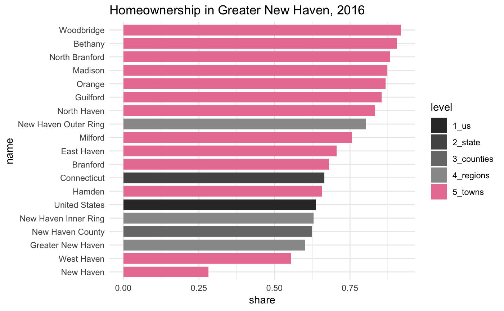

<!-- README.md is generated from README.Rmd. Please edit that file -->
cwi
===

The goal of cwi is to get data, primarily the Census ACS, fetched, aggregated, and analyzed for DataHaven's 2019 Community Index reports. This includes functions to speed up and standardize analysis for multiple staff people, preview trends and patterns we'll need to write about, and get data in more layperson-friendly formats.

It depends on many functions from Camille's brilliantly-named [`camiller`](https://github.com/camille-s/camiller) package.

Installation
------------

You can install the development version from [GitHub](https://github.com/CT-Data-Haven/cwi) with:

``` r
# install.packages("devtools")
devtools::install_github("CT-Data-Haven/cwi")
```

Dependencies
------------

In addition to `camiller`, this package relies heavily on:

-   The [`tidyverse`](http://tidyverse.org/) packages, namely `magrittr`, `dplyr`, `tidyr`, `purrr`, `readr`, `stringr`, and `forcats` (so basically *all* the tidyverse)
-   The map-previewing function `acs_quick_map()` requires `ggplot2` version 2.2.3—as of 7/2/2018, this is still the dev version on [GitHub](https://github.com/tidyverse/ggplot2), but is slated for release on CRAN (as 3.0.0) by the end of the month
-   `rlang` and `tidyselect` for non-standard evaluation in many functions
-   `tidycensus` for actually getting all the Census data
-   `sf` isn't required but it's encouraged

Data
----

`cwi` ships with several datasets and shapefiles. These include:

-   Shapes (as `sf` objects) of towns, tracts, and city neighborhoods for New Haven, Hartford, Bridgeport, and Stamford
-   Common ACS table numbers—hopefully decreases time spent prowling around FactFinder
-   Definitions of neighborhoods by tract or block group, and of regions by town

Example
-------

Here's an example of getting a big table to calculate homeownership rates across many geographies at once:

``` r
library(tidyverse)
library(cwi)
```

``` r
tenure <- multi_geo_acs(
  table = basic_table_nums$tenure,
  year = 2016,
  regions = regions[c("Greater New Haven", "New Haven Inner Ring", "New Haven Outer Ring")],
  counties = "New Haven",
  us = T
)
#> Geographies included:
#> Towns: all
#> Regions: Greater New Haven, New Haven Inner Ring, New Haven Outer Ring
#> Counties: New Haven County
#> State: 09
#> US: Yes
```

``` r
tenure
#> # A tibble: 99 x 8
#>    GEOID NAME              variable    estimate    moe level  state county
#>    <chr> <chr>             <chr>          <dbl>  <dbl> <chr>  <chr> <chr> 
#>  1 1     United States     B25003_001 117716237 222078 1_us   <NA>  <NA>  
#>  2 1     United States     B25003_002  74881068 360470 1_us   <NA>  <NA>  
#>  3 1     United States     B25003_003  42835169 142056 1_us   <NA>  <NA>  
#>  4 09    Connecticut       B25003_001   1354713   3509 2_sta… <NA>  <NA>  
#>  5 09    Connecticut       B25003_002    900223   5427 2_sta… <NA>  <NA>  
#>  6 09    Connecticut       B25003_003    454490   3843 2_sta… <NA>  <NA>  
#>  7 09009 New Haven County  B25003_001    326487   1531 3_cou… 09    <NA>  
#>  8 09009 New Haven County  B25003_002    203568   1887 3_cou… 09    <NA>  
#>  9 09009 New Haven County  B25003_003    122919   1716 3_cou… 09    <NA>  
#> 10 <NA>  Greater New Haven B25003_001    177415   1434 4_reg… <NA>  <NA>  
#> # ... with 89 more rows
```

``` r
homeownership <- tenure %>%
  label_acs() %>%
  select(name = NAME, level, label, estimate) %>%
  filter((!str_detect(level, "towns")) | name %in% regions$`Greater New Haven`) %>%
  mutate(label = str_remove(label, "Total!!")) %>%
  group_by(level, name) %>%
  camiller::calc_shares(group = label) %>%
  filter(label == "Owner occupied")

homeownership
#> # A tibble: 19 x 5
#> # Groups:   level, name [19]
#>    level      name                 label          estimate share
#>    <chr>      <chr>                <fct>             <dbl> <dbl>
#>  1 1_us       United States        Owner occupied 74881068 0.636
#>  2 2_state    Connecticut          Owner occupied   900223 0.665
#>  3 3_counties New Haven County     Owner occupied   203568 0.624
#>  4 4_regions  Greater New Haven    Owner occupied   106876 0.602
#>  5 4_regions  New Haven Inner Ring Owner occupied    34337 0.629
#>  6 4_regions  New Haven Outer Ring Owner occupied    58447 0.802
#>  7 5_towns    Bethany              Owner occupied     1807 0.904
#>  8 5_towns    Branford             Owner occupied     8331 0.679
#>  9 5_towns    East Haven           Owner occupied     7919 0.705
#> 10 5_towns    Guilford             Owner occupied     7314 0.855
#> 11 5_towns    Hamden               Owner occupied    15335 0.657
#> 12 5_towns    Madison              Owner occupied     5932 0.874
#> 13 5_towns    Milford              Owner occupied    16314 0.757
#> 14 5_towns    New Haven            Owner occupied    14092 0.282
#> 15 5_towns    North Branford       Owner occupied     4818 0.883
#> 16 5_towns    North Haven          Owner occupied     6969 0.833
#> 17 5_towns    Orange               Owner occupied     4267 0.867
#> 18 5_towns    West Haven           Owner occupied    11083 0.555
#> 19 5_towns    Woodbridge           Owner occupied     2695 0.919
```

``` r
geo_level_plot(homeownership, value = share, hilite = "#EA7FA2", 
               title = "Homeownership in Greater New Haven, 2016")
```



See more detail in the vignette: `vignette("Basic workflow", "cwi")`.
