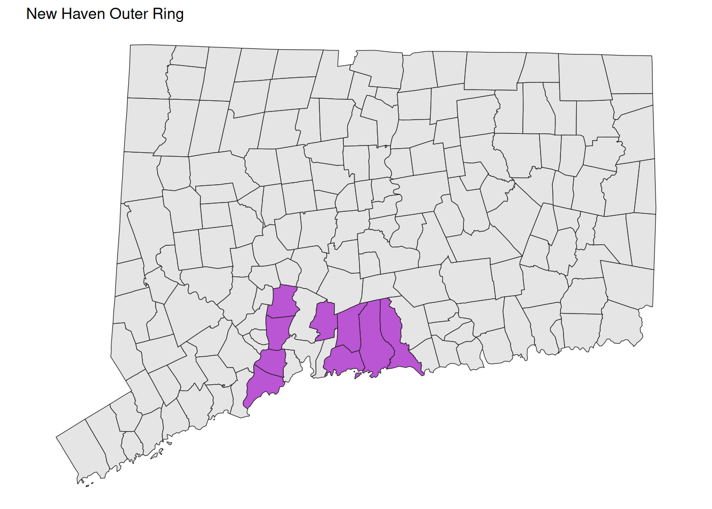

# Regions

There are too many regions stored here now that the state is switching
to COGs instead of counties. Here’s a visual reference to them. Note
that Greater Hartford and the Capitol Region COG are the same, as are
Greater Bridgeport and Connecticut Metro COG.

