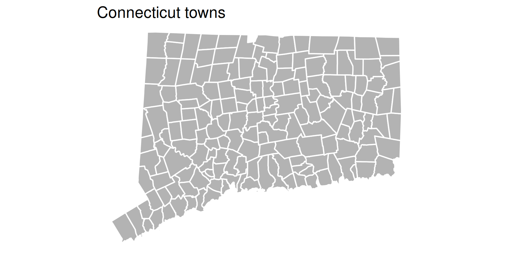
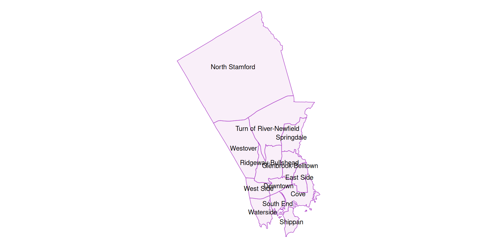

# Shapefiles

``` r
library(dplyr)
library(ggplot2)
library(cwi)
if (require(sf)) {
    sf::sf_use_s2(FALSE)
}
theme_set(theme_void())
```

`cwi` ships with several shapefiles in
[`sf`](https://r-spatial.github.io/sf/) (simple features) format. These
include:

- Shapes straight from
  [TIGER](https://www.census.gov/geo/maps-data/data/tiger.html) via
  [`tigris`](https://github.com/walkerke/tigris):
  - `town_sf`
  - `tract_sf`
- Shapes put together at DataHaven based on official city neighborhood
  boundaries:
  - `bridgeport_sf`
  - `hartford_sf`
  - `new_haven_sf`
  - `stamford_sf`

## `sf`

`sf` objects are easy to plot either out of the box with
[`sf::plot.sf()`](https://r-spatial.github.io/sf/reference/plot.html),
or with
[`ggplot2::ggplot()`](https://ggplot2.tidyverse.org/reference/ggplot.html)
as of `ggplot2` version 3.0.0. Use with
[`ggplot()`](https://ggplot2.tidyverse.org/reference/ggplot.html) means
a [`geom_sf()`](https://ggplot2.tidyverse.org/reference/ggsf.html) can
be overlayed on a basemap from `ggmap`, as is done in the neighborhood
examples.

`sf` is well-documented, and uses `dplyr`-type functions to allow for
mutating, filtering, summarizing, joining, and most other data wrangling
functions. See the `sf` vignettes for help getting started:
`vignette(package = "sf")`.

`sf` data frames look and act like other data frames, but with shape
information attached.

## Statewide

A basic plot of
[`cwi::town_sf`](https://CT-Data-Haven.github.io/cwi/reference/town_sf.md),
with some `ggplot` aesthetics set, graticule lines turned off with
`coord_sf(ndiscr = F)`, and a blank theme.

``` r
ggplot(town_sf) +
    geom_sf(fill = "gray70", color = "white", linewidth = 0.5) +
    ggtitle("Connecticut towns")
```



With some `dplyr` operations. For example,
[`group_by()`](https://dplyr.tidyverse.org/reference/group_by.html)
followed by
[`summarise()`](https://dplyr.tidyverse.org/reference/summarise.html)
conducts a union on each group’s geometries, using
[`sf::st_union()`](https://r-spatial.github.io/sf/reference/geos_combine.html)
in its back-end.

``` r
town_sf |>
    filter(name %in% regions[["Greater New Haven"]]) |>
    group_by(area = ifelse(name == "New Haven", "New Haven", "New Haven suburbs")) |>
    summarise() |>
    ggplot() +
    geom_sf(aes(fill = area), color = "white") +
    scale_fill_manual(values = c("New Haven" = "mediumorchid", "New Haven suburbs" = "gray70")) +
    theme(legend.position = "bottom") +
    ggtitle("Filtering and unioning shapes")
```


[`cwi::tract_sf`](https://CT-Data-Haven.github.io/cwi/reference/tract_sf.md),
a fairly large shape containing all tracts in the state, as of 2020
redistricting.

``` r
ggplot(tract_sf) +
    geom_sf(fill = "gray70", color = "white", linewidth = 0.1) +
    ggtitle("Connecticut tracts")
```


## Neighborhoods

Neighborhood shapes were made at DataHaven by splitting or grouping
census tracts into neighborhood areas as defined by each city’s
government. In some cases, boundaries were slightly adjusted to fit
tracts. Small neighborhoods may be grouped together for analysis. See
documentation of these at
[`cwi::neighborhood_shapes`](https://CT-Data-Haven.github.io/cwi/reference/neighborhood_shapes.md)
and crosswalk of tracts to neighborhoods at
[`cwi::neighborhood_tracts`](https://CT-Data-Haven.github.io/cwi/reference/neighborhood_tracts.md).

``` r
list(
    "New Haven" = new_haven_sf, Stamford = stamford_sf,
    "Hartford/West Hartford" = hartford_sf, Bridgeport = bridgeport_sf
) |>
    purrr::iwalk(function(shp, title) {
        p <- ggplot(shp) +
            geom_sf(color = "mediumorchid3", fill = "orchid3", alpha = 0.1) +
            geom_sf_text(aes(label = name), size = 2)
        print(p)
    })
```





