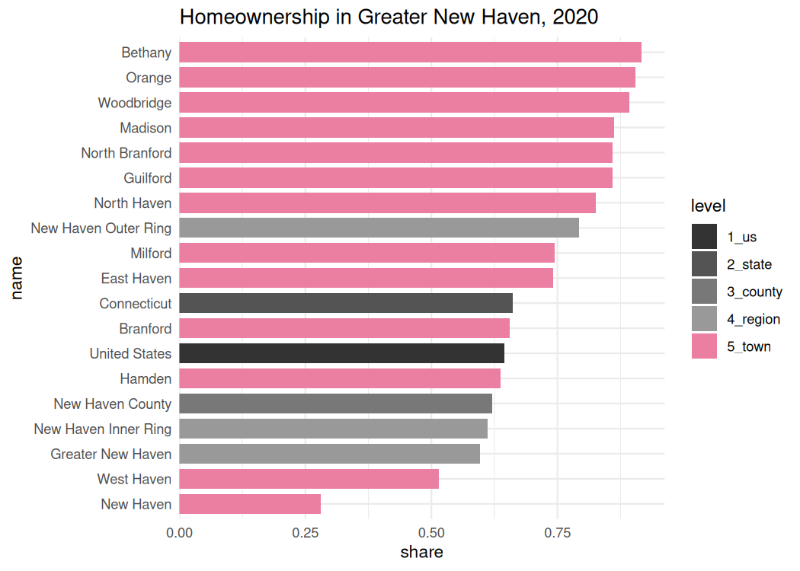

# cwi

The original goal of `cwi` was to get data, primarily the Census ACS,
fetched, aggregated, and analyzed for [DataHaven’s 2019 Community Index
reports](http://ctdatahaven.org/reports/greater-new-haven-community-index).
It’s now evolved to support more of our day-to-day work and several
major reports. This includes functions to speed up and standardize
analysis for multiple staff people, preview trends and patterns we’ll
need to write about, and get data in more layperson-friendly formats.

It pairs well with many functions from Camille’s brilliantly-named
[`camiller`](https://github.com/camille-s/camiller) package, though no
longer depends on it.

## Installation

You can install this package from
[GitHub](https://github.com/CT-Data-Haven/cwi) with:

``` r
# install.packages("devtools")
devtools::install_github("CT-Data-Haven/cwi")
```

## Dependencies

This package relies heavily on:

- The [`tidyverse`](http://tidyverse.org/) packages, namely `dplyr`,
  `tidyr`, `purrr`, `stringr`, `forcats`, and `ggplot2` (version \>=
  3.0.0) (so a lot the tidyverse)
- `rlang` and `tidyselect` for non-standard evaluation in many functions
- `tidycensus` for actually getting all the Census data
- `sf` isn’t required but it’s encouraged

## Data

`cwi` ships with several datasets and shapefiles. These include:

- Shapes (as `sf` objects) of towns, tracts, and city neighborhoods for
  New Haven, Hartford, Bridgeport, and Stamford
- Common ACS table numbers—hopefully decreases time spent prowling
  around [the Census Bureau site](https://data.census.gov)
- Definitions of neighborhoods by tract or block group, and of regions
  by town

## Sources

This package contains functions to make it easier and more reproducible
to fetch and analyze data from:

- [American Community
  Survey](https://www.census.gov/programs-surveys/acs/) (US Census
  Bureau)
- [Decennial
  Census](https://www.census.gov/programs-surveys/decennial-census.html)
  (US Census Bureau)
- [Quarterly Workforce Indicators](https://lehd.ces.census.gov/) (US
  Census Bureau Center for Economic Studies)
- [Local Area Unemployment Statistics](https://www.bls.gov/lau/) (Bureau
  of Labor Statistics)
- ~~[DataHaven’s Community Wellbeing
  Survey](https://ctdatahaven.org/reports/datahaven-community-wellbeing-survey)~~
  This has been moved to the dcws package

## Example

Here’s an example of getting a big table to calculate homeownership
rates across many geographies at once:

``` r
library(dplyr)
library(cwi)
```

``` r
tenure <- multi_geo_acs(
    table = basic_table_nums$tenure,
    year = 2020,
    regions = regions[c("Greater New Haven", "New Haven Inner Ring", "New Haven Outer Ring")],
    counties = "New Haven",
    towns = regions[["Greater New Haven"]],
    us = TRUE
)
tenure
#> # A tibble: 57 × 9
#>     year level    state       county geoid name         variable estimate    moe
#>    <dbl> <fct>    <chr>       <chr>  <chr> <chr>        <chr>       <dbl>  <dbl>
#>  1  2020 1_us     <NA>        <NA>   1     United Stat… B25003_…   1.22e8 211970
#>  2  2020 1_us     <NA>        <NA>   1     United Stat… B25003_…   7.88e7 342600
#>  3  2020 1_us     <NA>        <NA>   1     United Stat… B25003_…   4.36e7 134985
#>  4  2020 2_state  <NA>        <NA>   09    Connecticut  B25003_…   1.39e6   3268
#>  5  2020 2_state  <NA>        <NA>   09    Connecticut  B25003_…   9.15e5   5015
#>  6  2020 2_state  <NA>        <NA>   09    Connecticut  B25003_…   4.70e5   4548
#>  7  2020 3_county Connecticut <NA>   09009 New Haven C… B25003_…   3.33e5   1647
#>  8  2020 3_county Connecticut <NA>   09009 New Haven C… B25003_…   2.07e5   2123
#>  9  2020 3_county Connecticut <NA>   09009 New Haven C… B25003_…   1.26e5   2225
#> 10  2020 4_region Connecticut <NA>   <NA>  Greater New… B25003_…   1.76e5   1834
#> # ℹ 47 more rows
```

``` r
homeownership <- tenure |>
    label_acs(year = 2020) |>
    dplyr::group_by(level, name) |>
    calc_shares(group = label, denom = "Total") |>
    dplyr::filter(stringr::str_detect(label, "Owner")) |>
    dplyr::select(level, name, share)

homeownership
#> # A tibble: 19 × 3
#> # Groups:   level, name [19]
#>    level    name                 share
#>    <fct>    <chr>                <dbl>
#>  1 1_us     United States         0.64
#>  2 2_state  Connecticut           0.66
#>  3 3_county New Haven County      0.62
#>  4 4_region Greater New Haven     0.6 
#>  5 4_region New Haven Inner Ring  0.61
#>  6 4_region New Haven Outer Ring  0.79
#>  7 5_town   Bethany               0.92
#>  8 5_town   Branford              0.65
#>  9 5_town   East Haven            0.74
#> 10 5_town   Guilford              0.86
#> 11 5_town   Hamden                0.64
#> 12 5_town   Madison               0.86
#> 13 5_town   Milford               0.75
#> 14 5_town   New Haven             0.28
#> 15 5_town   North Branford        0.86
#> 16 5_town   North Haven           0.83
#> 17 5_town   Orange                0.91
#> 18 5_town   West Haven            0.51
#> 19 5_town   Woodbridge            0.89
```

``` r
geo_level_plot(homeownership,
    value = share, hilite = "#EA7FA2",
    title = "Homeownership in Greater New Haven, 2020"
)
```



See more detail in the vignette:
[`vignette("cwi")`](https://CT-Data-Haven.github.io/cwi/articles/cwi.md).
