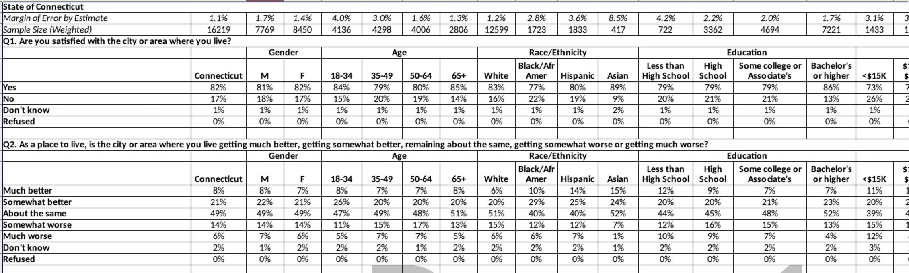

```{r setup, include=FALSE}
knitr::opts_chunk$set(
  fig.height = 3,
  fig.width = 6,
  message = TRUE,
  warning = FALSE,
  collapse = TRUE,
  comment = "#>",
  dpi = 150
)
```

```{r libs, message=FALSE, warning=FALSE}
library(dplyr)
library(stringr)
library(cwi)

# tiny theme of a few cleaned up arguments
theme_clean <- function(...) {
  theme_gray() +
    theme(
      strip.placement = "outside",
      strip.text.y.left = element_text(angle = 0, hjust = 0),
      strip.text = element_text(face = "bold"),
      panel.grid = element_blank(),
      panel.background = element_blank(),
      plot.title.position = "plot",
      plot.title = element_text(size = rel(1.1)),
      axis.ticks = element_blank(),
      ...
    )
}
```

This is a quick look at using the crosstab-related functions that were expanded upon to make the `dcws` package. There are 3 test files of crosstabs that ship with this package for internal testing and illustration. This vignette recreates the data in the `cws_demo` dataset. 

{ width=100% }

## Reading data

`read_xtabs` reads a crosstab file, but keeps it ugly—you can then transform it into a ready-for-analysis data frame with `xtab2df`. Below all the survey data, the file has a table of weights. It's hard to know where that table might be and how to separate it from the data tables. `read_xtabs` reads until a marker that distinguishes between the data and the weights; `read_weights` reads everything below that marker.

The data for the first question looks like this:

```{r read_xtabs}
xtab_in <- read_xtabs(system.file("extdata/test_xtab2015.xlsx", package = "cwi"), year = 2015)

xtab_in[1:7, ]
```

Reshape the crosstabs into something you'd actually want to work with using `xtab2df`. That snippet from the first chunk now looks like this:

```{r xtab2df}
cws <- xtab2df(xtab_in)

cws %>%
  filter(code == "Q8") %>%
  utils::head()
```

## Combining demographic groups

Say we want to collapse those income brackets into just 3 groups. For that, use the weights table...and fix the group labels in the weights table to match the ones from the data (I'm only doing this for income, but education often needs reconciling as well). Obviously there won't be weights for the total group; in doing weighted means, the easiest fix is to replace NAs with 1. (FYI, groups Yes and No correspond to the category of having children in the household.)

```{r read_weights}
wts_in <- read_weights(system.file("extdata/test_xtab2015.xlsx", package = "cwi"))
wts_in

wts <- wts_in %>%
  mutate(group = group %>%
    str_replace("(?<=\\d) to (?=[\\$\\d])", "-") %>%
    str_replace_all(",000", "K") %>%
    str_replace("Less than (?=\\$)", "<") %>%
    str_replace(" or more", "+"))

income_lvls <- list(
  "<$30K" = c("<$15K", "$15K-$30K"),
  "$30K-$100K" = c("$30K-$50K", "$50K-$75K", "$75K-$100K"),
  "$100K+" = c("$100K-$200K", "$200K+")
)

cws %>%
  filter(code == "Q8", category %in% c("Greater New Haven", "Income")) %>%
  left_join(wts, by = "group") %>%
  mutate(across(category:response, forcats::as_factor)) %>%
  tidyr::replace_na(list(weight = 1)) %>%
  collapse_n_wt(c(code, category:response), .lvls = income_lvls)
```

## Rescaling

We generally want to remove non-answers (don't know, refused) from the denominator, then rescale the response values. Usually those non-answers only account for 1 or 2 percentage points and don't change values much, but occasionally they're large enough to make a noticeable difference. For consistency, I always remove non-answers, even when they're small.

With non-answers:

```{r nons1}
cws %>%
  filter(code == "Q1", category %in% c("Greater New Haven", "Gender", "Age"))
```

Without nonanswers (using `sub_nonanswers` defaults of "Don't know" & "Refused"):

```{r nons2}
cws %>%
  filter(code == "Q1", category %in% c("Greater New Haven", "Gender", "Age")) %>%
  sub_nonanswers()
```

## Case study

For many questions, what you probably want to report out or display is the share of people who answered yes, or the combination of "strongly agree" & "somewhat agree".

```{r chart, out.width="100%"}
library(ggplot2)

cws %>%
  filter(code == "Q1", category %in% c("Greater New Haven", "Gender", "Age")) %>%
  sub_nonanswers() %>%
  filter(response == "Yes") %>%
  mutate(across(category:group, forcats::as_factor),
    group = group %>%
      forcats::fct_recode(Men = "M", Women = "F") %>%
      forcats::fct_relabel(str_replace, "(^\\b)(?=\\d+)", "Ages "),
    category = forcats::fct_recode(category, Total = "Greater New Haven"),
    lbl = scales::percent(value, accuracy = 1)
  ) %>%
  ggplot(aes(x = forcats::fct_rev(group), y = value)) +
  geom_col(width = 0.8, fill = "#047e87") +
  geom_text(aes(label = lbl), hjust = 1, nudge_y = -0.01, fontface = "bold", color = "white") +
  scale_y_continuous(breaks = NULL, expand = expansion(mult = c(0, 0.05))) +
  coord_flip() +
  facet_grid(rows = vars(category), scales = "free_y", space = "free_y", switch = "y") +
  theme_clean() +
  labs(
    x = NULL, y = NULL,
    title = "Neighborhood satisfaction is high across age and gender",
    subtitle = "Share of adults satisfied with area, Greater New Haven, 2015",
    caption = "Source: 2015 DataHaven Community Wellbeing Survey"
  )
```

Note that different questions have different response values. In general, it's better to work with each question separately; easy and safe ways to do this are to make separate data frames for different questions (e.g. with `dplyr::filter`), or by splitting (e.g. with `split(data$question)`) and iterating with `lapply` or `purrr::map` before binding or joining back together.

```{r responses}
cws %>%
  distinct(code, question, response) %>%
  filter(!stringr::str_detect(response, "(Don't know|Refused)")) %>%
  group_by(question = stringr::str_trunc(question, width = 100)) %>%
  summarise(responses = paste(response, collapse = ", "))
```

A common use is to show multiple related indicators side by side in a table or chart. Here I'm prepping to show both the question about neighborhood satisfaction (yes / no) and the responsiveness of local government (combined excellent & good).

```{r govt_chart, out.width="100%", fig.height=5}
govt <- cws %>%
  mutate(across(c(category, group), forcats::as_factor)) %>%
  filter(code %in% c("Q1", "Q3A")) %>%
  split(.$code)

cws_out <- list()

cws_out[["satisfied_with_area"]] <- govt$Q1 %>%
  sub_nonanswers() %>%
  filter(response == "Yes")

cws_out[["local_govt_is_responsive"]] <- govt$Q3A %>%
  mutate(response = forcats::as_factor(response) %>%
    forcats::fct_collapse(excellent_good = c("Excellent", "Good"))) %>%
  group_by(across(-value)) %>%
  summarise(value = sum(value)) %>%
  sub_nonanswers(nons = c("Don't know enough about it in order to say", "Refused")) %>%
  filter(response == "excellent_good")

cws_out %>%
  bind_rows(.id = "indicator") %>%
  mutate(
    group = group %>%
      forcats::fct_relabel(str_replace, "(^\\b)(?=\\d+)", "Ages ") %>%
      forcats::fct_recode(Black = "Black/Afr Amer"),
    category = ifelse(as.character(category) == as.character(group), "Total", as.character(category)) %>% forcats::as_factor(),
    lbl = scales::percent(value, accuracy = 1),
    indicator = camiller::clean_titles(indicator)
  ) %>%
  filter(category %in% c("Total", "Age", "Race/Ethnicity")) %>%
  ggplot(aes(x = forcats::fct_rev(group), y = value)) +
  geom_col(width = 0.8, fill = "#047e87") +
  geom_text(aes(label = lbl), hjust = 1, nudge_y = -0.01, fontface = "bold", color = "white") +
  scale_y_continuous(breaks = NULL, expand = expansion(mult = c(0, 0.05))) +
  coord_flip() +
  facet_grid(rows = vars(category), cols = vars(indicator), scales = "free", space = "free_y", switch = "y") +
  theme_clean() +
  labs(
    x = NULL, y = NULL,
    title = "Neighborhood satisfaction is high, even when government\nfeels unresponsive",
    subtitle = "Share of adults, Greater New Haven, 2015",
    caption = "Source: 2015 DataHaven Community Wellbeing Survey"
  )
```


